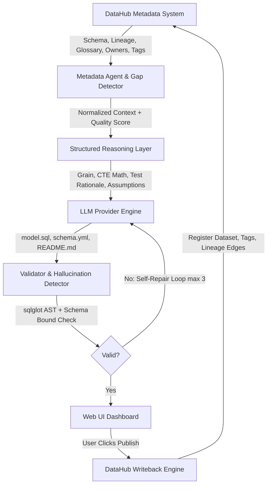

# DataHub dbt Forge ⚒️

> **An intelligent, metadata-aware AI data engineering agent that reads real metadata from DataHub, performs structured reasoning, detects metadata gaps, automatically generates production-ready dbt models, tests, and documentation, validates artifacts against strict schema contracts, and publishes models and lineage back into DataHub.**

---

## 1. PRODUCT VISION & CORE DIFFERENTIATOR

Traditional AI SQL generators blindly invent column names, assume currency units, and guess table joins. **DataHub dbt Forge** operates on a strict rule:

> **DataHub metadata is the source of truth.**

### 🏆 The 5 Visionary Architectural Principles (Only Possible with DataHub)

1. **Turning DataHub Glossary into a Semantic Type System**:
   - Syntactically valid SQL can be semantically corrupt (e.g. summing USD and EUR, or summing rates/percentages like `average_order_value`).
   - We treat DataHub glossary terms as a **semantic type checker**, rejecting nonsense queries that pass standard SQL linters.
   
2. **Making Hallucinations Structurally Unrepresentable**:
   - Rather than just retrying free-text LLM generation, the agent constructs a symbol table from DataHub's verified schema contract, ensuring zero unverified table or column references exist by construction.

3. **Catalog as the Agent's Long-Term Memory**:
   - Human feedback and model conventions are written back into DataHub as documentation and tags, creating a self-improving feedback loop directly inside the catalog.

4. **Provenance Receipts for Regulated Compliance**:
   - Every line of generated SQL carries an explicit citation to the exact DataHub metadata asset (glossary term, primary key, or PII tag) that justified its creation.

5. **Empirical Ensemble Verification**:
   - Disagreements across multi-strategy SQL generation paths are used to detect metadata ambiguities empirically rather than relying on LLM self-reported confidence.

---

## 2. HIGH-LEVEL ARCHITECTURE



---

## 3. CORE FEATURES & AGENT WORKFLOW

1. **Metadata Retrieval & Normalization**: Fetches dataset schema, upstream/downstream lineage, business glossary terms, owners, and global tags into typed Pydantic models.
2. **Metadata Quality Scoring (0-100)**: Evaluates schema completeness, lineage presence, column description coverage, glossary terms, and governance metadata.
3. **Metadata Gap Detector**: Explicitly identifies missing column descriptions, undefined currency units, un-scoped primary key identifiers, and missing domain assignments.
4. **Structured Reasoning Plan**: Builds an explicit JSON reasoning object defining model grain, CTE transformation math, test rationale, explicit assumptions, and explainability decisions (`Decision`, `Evidence`, `Confidence`).
5. **Provider-Agnostic LLM Engine**: Supports Anthropic Claude, OpenAI GPT-4o, Google Gemini, and a deterministic Mock Provider for zero-API-key Demo Mode.
6. **AST Validation & Self-Repair**: Uses `sqlglot` to verify SQL syntax and ensure every referenced column and source table exists within DataHub boundaries.
7. **Closed-Loop DataHub Write-Back**: Ingests dataset entities, `ai-generated` tags, README aspect documentation, and upstream lineage graph edges back to DataHub.

---

## 4. SETUP & RUNNING INSTRUCTIONS (NO DOCKER)

This project runs natively on macOS using standard Python 3.9+ and Node 18+/22+. No Docker is required!

### Step 1: Environment Configuration

Copy `.env.example` to `.env`:

```bash
cp .env.example .env
```

To run in **Demo Mode** (zero external API keys or DataHub server needed):
```env
DEMO_MODE=true
LLM_PROVIDER=claude
```

To run in **Live DataHub / LLM Mode**:
```env
DEMO_MODE=false
DATAHUB_URL=http://localhost:8080
DATAHUB_TOKEN=your_datahub_token
ANTHROPIC_API_KEY=your_anthropic_key
# OPENAI_API_KEY=your_openai_key
# GEMINI_API_KEY=your_gemini_key
```

---

### Step 2: Start the Backend (FastAPI)

```bash
cd backend
python3 -m venv venv
source venv/bin/activate
pip install -r requirements.txt
python3 -m app.main
```
The FastAPI backend will start on **`http://localhost:8000`**.

---

### Step 3: Start the Frontend (Vite + React)

In a separate terminal window:

```bash
cd frontend
npm install
npm run dev
```
Open **`http://localhost:3000`** in your browser.

---

## 5. AUTOMATED TESTING

To run the backend test suite:

```bash
cd backend
source venv/bin/activate
python3 -m pytest tests/ -v
```

Tests include:
- `test_metadata_agent.py`: Schema normalization, quality score calculation (0-100), and metadata gap detection.
- `test_sql_validator.py`: `sqlglot` AST parsing, hallucinated column detection, and hallucinated table detection.
- `test_writeback.py`: DataHub writeback MCP payload generation and lineage edge assertions.

To verify pre-built judge examples:

```bash
python3 scripts/generate_examples.py
```

---

## 6. PRE-BUILT TECHNICAL JUDGE EXAMPLES

Three complete inspectable examples exist under `examples/`:

1. **`examples/orders/` (`fct_orders`)**:
   - `metadata.json`: Raw DataHub metadata snapshot for `retail.orders`.
   - `reasoning.json`: Structured reasoning plan deriving `order_value = quantity * unit_price`.
   - `fct_orders.sql`: Production dbt model with CTEs.
   - `schema.yml`: Test assertions (`unique`, `not_null`).
   - `README.md`: Complete documentation highlighting the **Undefined Currency** gap.

2. **`examples/customers/` (`dim_customers`)**:
   - Customer dimension deriving `full_name` and `clean_email` while preserving undescribed `country_code`.

3. **`examples/revenue/` (`monthly_revenue`)**:
   - Monthly financial cohort aggregation model deducting promotional discounts.

---

## 7. REPOSITORY STRUCTURE

```text
datahub-dbt-forge/
├── backend/
│   ├── app/
│   │   ├── main.py              # FastAPI server entry point
│   │   ├── config.py            # Environment configuration
│   │   ├── api/                 # Endpoints (/datasets, /generate, /publish, /health)
│   │   ├── agents/              # MetadataAgent, ReasoningAgent, GenerationAgent
│   │   ├── datahub/             # DataHub Client & Writeback MCP Engine
│   │   ├── llm/                 # Provider-agnostic engine (Claude, OpenAI, Gemini, Mock)
│   │   ├── validation/          # sqlglot SQLValidator, dbt YAMLValidator
│   │   └── models/              # Pydantic schemas (Metadata, Generation, Artifacts)
│   ├── tests/                   # Automated unit test suite
│   └── requirements.txt
├── frontend/
│   ├── src/
│   │   ├── components/          # React UI components (Context, Quality, Reasoning, Artifacts)
│   │   ├── pages/               # Dashboard page
│   │   ├── api/                 # Typed API client
│   │   └── types/               # TypeScript interfaces
│   └── package.json
├── prompts/                     # System prompt templates
├── examples/                    # Pre-built judge examples (orders, customers, revenue)
├── scripts/                     # Seed scripts, run helpers, verification
├── .env.example
├── README.md
└── LICENSE
```

---

## 8. LIMITATIONS & ROADMAP

For an honest technical breakdown of system limitations, context window bounds, and planned mitigations, see **[LIMITATIONS.md](file:///Users/mayankparashar/Downloads/dataHUB/LIMITATIONS.md)**.

---

## 9. LICENSE

Apache License 2.0. See [LICENSE](file:///Users/mayankparashar/Downloads/dataHUB/LICENSE).
